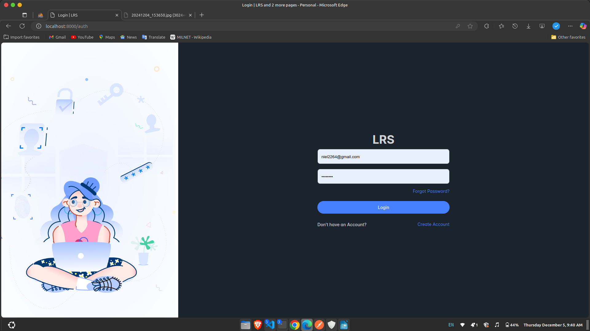
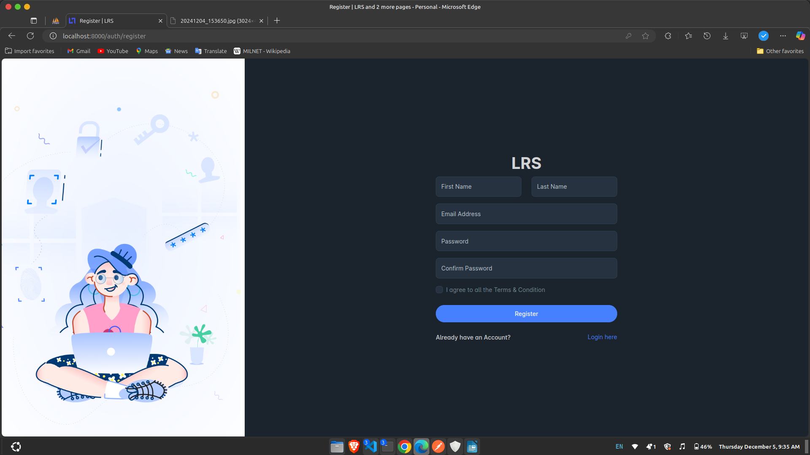
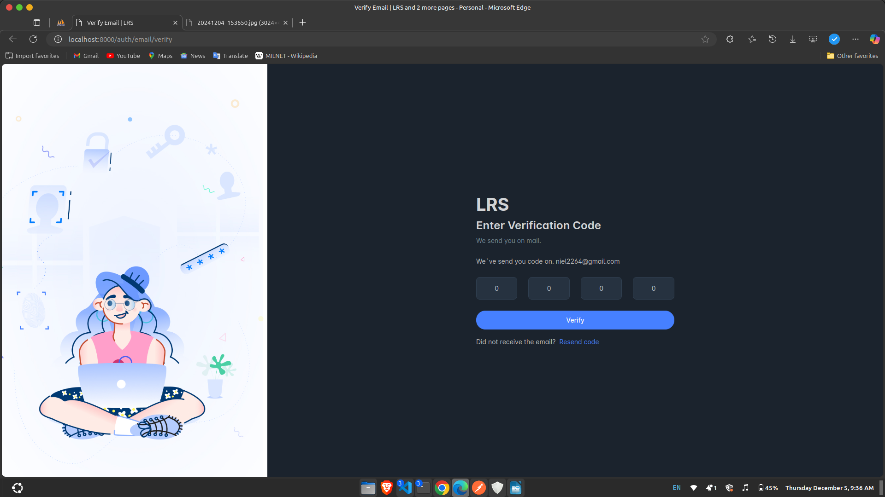
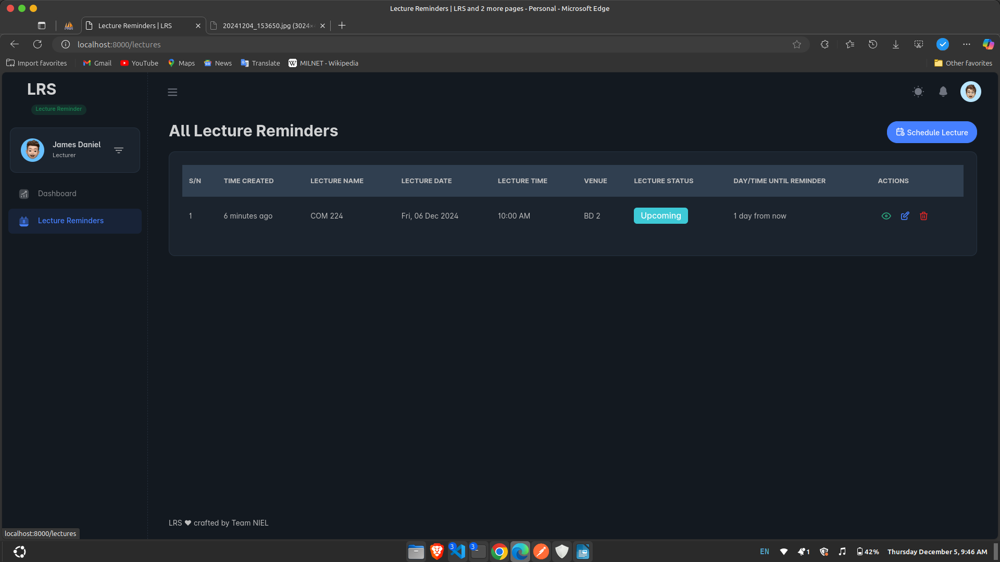
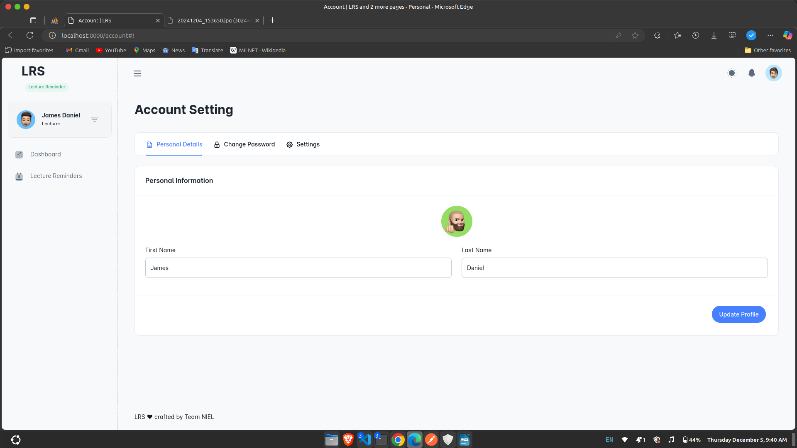

# LECTURE REMINDER SYSTEM

The **Lecture Reminder System** is a web application developed using **Laravel** that helps lecturers manage their schedules by sending them timely reminders of their upcoming lectures. The system ensures that lecturers receive notifications about their pending classes, reducing the chances of missing a lecture and improving overall scheduling efficiency.

---

## Features

### 1. **Login Page**
The system provides a secure login page where lecturers can enter their credentials to access their personalized dashboard. The login page ensures that only authorized lecturers can access the system.

---

### 2. **Register Page**
Lecturers who don't have an account can register through the registration page. They can sign up with basic details and create their account to start using the system.

---

### 3. **OTP Confirmation Page**
For added security, lecturers will receive an OTP (One-Time Password) to confirm their registration or login. This step ensures that only authorized users can access the system.

---

### 4. **Dashboard**
The lecturer’s dashboard provides a summary of upcoming classes, pending lectures, and recent reminders. It serves as the central hub for managing lecture schedules and receiving reminders.

---

### 5. **Schedule Lecture Page**
Lecturers can input and manage their lecture schedules through this page. This feature allows them to set the date, time, and other details related to their upcoming lectures.

---

### 6. **All Lecture Reminders Page**
Lecturers can view a list of all their lecture reminders. The page shows detailed information about upcoming lectures and any associated reminders sent to them.

---

### 7. **Account Settings Page**
Lecturers can manage their account settings, including updating their personal information, changing passwords, and adjusting notification preferences.

---

## Technologies Used

This project utilizes the following technologies:

---

## Screenshots

Here are some screenshots of the **Lecture Reminder System**:

### Login Page
_The login page where lecturers can enter their credentials to log in to their account._

---

### Register Page
_The registration page where new lecturers can create their accounts by providing necessary details._

---

### OTP Confirmation Page
_The OTP confirmation page where lecturers confirm their registration or login with a one-time password sent to their email._

---

### Dashboard
_The lecturer dashboard provides an overview of their upcoming classes, reminders, and other important notifications._

---

### Schedule Lecture Page
_Lecturers can schedule and manage their upcoming lectures through this page._

---

### All Lecture Reminders
_A page where lecturers can view all their scheduled lecture reminders, ensuring they don't miss any important lectures._

---

### Account Settings
_Lecturers can update their profile, change their password, and manage notification preferences through the account settings page._

---

## Conclusion

The **Lecture Reminder System** aims to improve the efficiency and reliability of managing lecture schedules for lecturers. By sending timely reminders and providing an easy-to-use interface, the system helps lecturers stay on top of their commitments. Built using **Laravel**, **HTML**, **CSS**, **Bootstrap**, **JavaScript**, and **Livewire**, the system is both powerful and responsive, ensuring a smooth user experience.

For any questions or feedback, feel free to reach out:

**Contact**: [niel2264@gmail.com](mailto:niel2264@gmail.com)
